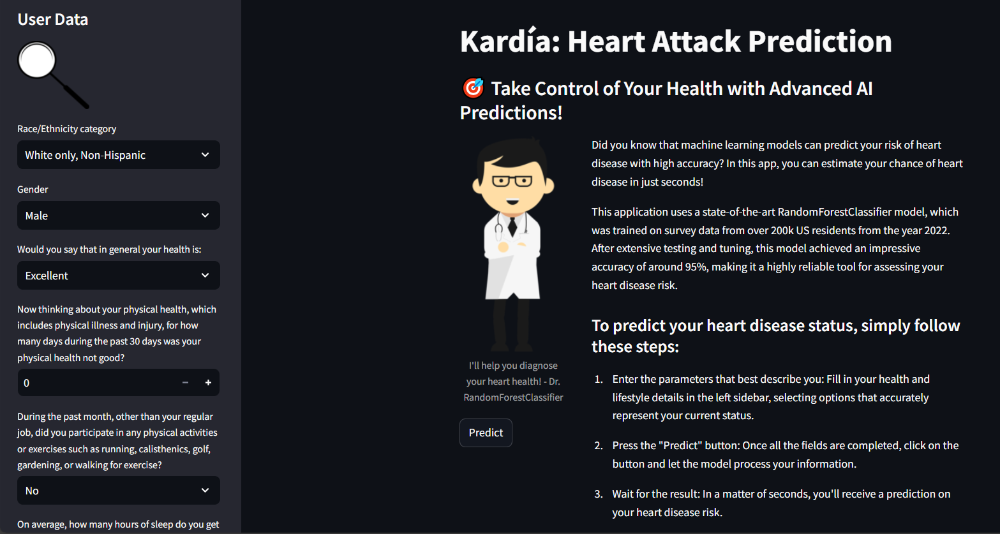
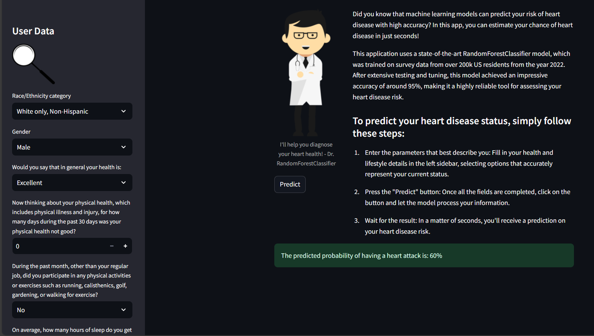

<br><br>

<!-- project philosophy -->


This project is divided into three parts:

- **ETL**: A streamlined pipeline for extracting, transforming, and loading health-related data.
- **Analysis**: Power BI was used to analyze key factors contributing to heart attacks.
- **Prediction App**: A machine learning Streamlit web application that uses a Random Forest Classifier to predict heart attack risk with 95% accuracy, based on user input.

### User Stories

- As a user, I want to input my personal health data, so I can receive a prediction on my likelihood of having a heart attack.
- As a user, I want to view the accuracy of the heart attack prediction model, so I can trust the results I'm given.
- As a user, I want to explore a Power BI report that visualizes heart attack data, so I can see how different health factors correlate with heart attacks.
- As a user, I want to filter the Power BI report by age, gender, and other health conditions, so I can focus on data relevant to me or my demographic.

<br><br>

<!-- Tech stack -->


### Kardía is built using the following technologies:

- Python: This project utilizes Python for creating the ETL (Extract, Transform, Load) pipeline, enabling efficient data handling and preprocessing.
- Streamlit: Streamlit is used to create the user interface for the machine learning model. It provides an interactive platform where users can input their data and receive heart attack predictions in real-time, making the model easy to use and accessible.
- MySQL: MySQL is used to design and manage the schema in the database, enabling organized, scalable, and efficient data storage.
- DVC (Data Version Control): DVC is employed to version the data, ensuring that every change in the dataset is tracked and reproducible. This is especially important in projects dealing with evolving data sources.
- Random Forest Classifier: The machine learning model at the heart of this project is built using Python. The Random Forest algorithm is chosen for its effectiveness in handling binary classification tasks, like predicting the likelihood of a heart attack.
- MLflow: For model versioning, MLflow is used to manage the lifecycle of the Random Forest model, including tracking experiments, packaging code into reproducible runs, and deploying models.
- PowerShell Scripts: To streamline and automate repetitive tasks such as running specific Python scripts or managing data workflows.

<br><br>

<!-- Database Design -->


### Architecting Data Excellence: Innovative Database Design Strategies:


<br><br>

<!-- Implementation -->


<!-- ### User Screens (Mobile)

| Login screen                              | Register screen                         | Landing screen                          | Loading screen                          |
| ----------------------------------------- | --------------------------------------- | --------------------------------------- | --------------------------------------- |
|  |  |  |  |
| Home screen                               | Menu Screen                             | Order Screen                            | Checkout Screen                         |
|  |  |  |  | -->

### User Screens (Streamlit Web App)

| Home screen                          | Prediction Screen                        |
| ------------------------------------ | ---------------------------------------- |
|  |  |

### User Screens (Power BI report)

| Overview screen                             | Personal Analysis Screen                           |
| ------------------------------------------- | -------------------------------------------------- |
|  |  |

<br><br>

<!-- Prompt Engineering -->
<!-- 

### Mastering AI Interaction: Unveiling the Power of Prompt Engineering:

> This project utilizes a Random Forest Classifier to predict the likelihood of heart attacks based on health-related features. By applying Chi-Square tests for feature selection, the most relevant factors contributing to heart attacks are identified. The model is versioned using MLflow, ensuring efficient tracking, management, and comparison of different model versions to continually improve prediction accuracy. This structured approach guarantees a robust and scalable machine learning pipeline for heart health predictions.

<br><br> -->

<!-- AWS Deployment -->
<!-- 

### Efficient AI Deployment: Unleashing the Potential with AWS Integration:

- This project leverages AWS deployment strategies to seamlessly integrate and deploy natural language processing models. With a focus on scalability, reliability, and performance, we ensure that AI applications powered by these models deliver robust and responsive solutions for diverse use cases.

<br><br> -->

<!-- Unit Testing -->
<!-- 

### Precision in Development: Harnessing the Power of Unit Testing:

- This project employs rigorous unit testing methodologies to ensure the reliability and accuracy of code components. By systematically evaluating individual units of the software, we guarantee a robust foundation, identifying and addressing potential issues early in the development process.

<br><br> -->

<!-- How to run -->


> To set up Kardía locally, follow these steps:

<!-- ### Prerequisites -->

### Installation

1. clone the repo

```sh
git clone https://github.com/mostafa-fallaha/heart-disease-prediction.git
cd heart-disease-prediction
```

2. install the required Python packages

```sh
pip instal -r requirements.txt
```

3. create the DVC storage

```sh
mkdir /tmp/dvc_heart
```

4. Download the parquet file.

[parquet file](https://drive.google.com/uc?export=download&id=1rXp1FxHpeMIqU9JV8NmVnJQ8X4fQnYtQ).
<br>
put it in `ETL/docs`.

5. create a `.env` file in the root of the project containing the following:<br>

```
DB_USER=your database username
DB_PASSWORD=your database password
DB_HOST=your host (usually localhost)
DB_PORT=the port where mysql is running (usually 3306)
DB_STAGING=the staging schema name (create the schema in mysql workbench, no need to create any table)
DB_DWH=the DWH schema name (you need to create tables, in the step 3)
VERSION=0.9 (this to increment the data version whenever you run the ETL process)
```

6. run the `extract.py` in the ETL folder to load to the staging schema.

7. in mysql workbench, create a new schema (the DWH schema) and put the name in the .env file (here `DB_DWH`). And then run the `final_dwh.sql` (you can find it in ETL/dwh) in the newly created schema to create the tables and the relations.

8. run the `transform.py` in the ETL folder to transform the data and load it to the DWH and to version the data via DVC.

9. run, train and version (via MLFLOW) the machine learning model that reads the data from DVC via the DVC python API.

```bash
cd DataScience
python3 model_versioning.py
```

10. run the mlflow ui: cd to the root directory

```bash
cd ..
mlflow ui
```

_this will take the whole terminal._

11. run the streamlit app: open a new terminal in the project directory.

```bash
cd DataScience
streamlit run app.py
```

Now, you should be able to run the Streamlit app locally and explore its features.
